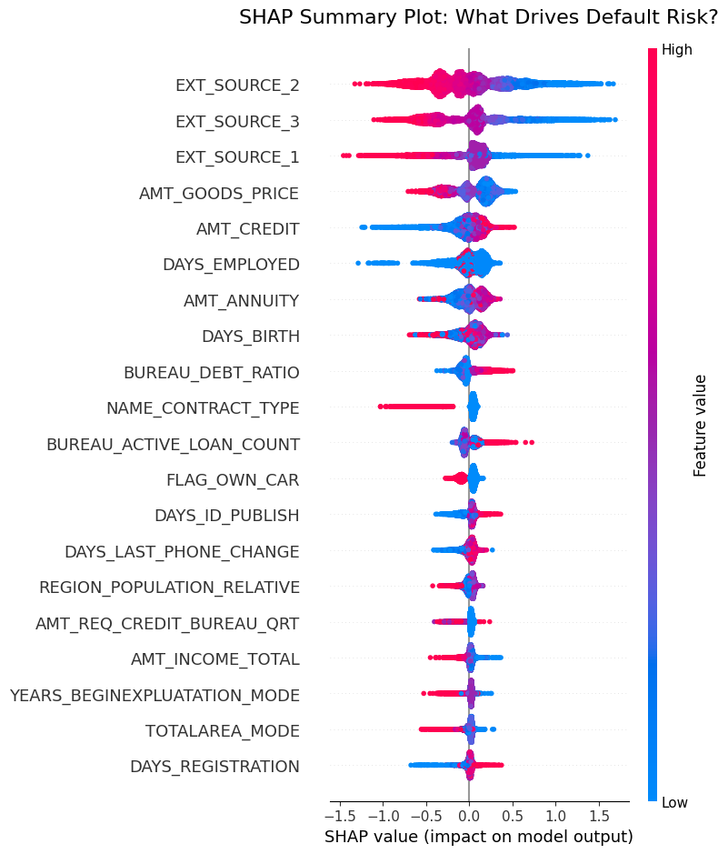

# 🏦 Home Credit Default Risk Prediction App

An end-to-end machine learning application and interactive risk management dashboard built to predict loan default probabilities. Powered by a optimized **LightGBM** classifier and interpreted using **SHAP (SHapley Additive exPlanations)**, this application demonstrates how explainable AI (XAI) can be integrated into credit risk evaluation frameworks to meet financial regulatory standards.

## Data Source & Setup 

1. **Download the Data:** Download the official dataset directly from the [Kaggle Home Credit Default Risk Competition](https://www.kaggle.com/c/home-credit-default-risk/data).
2. **Local Directory Structure:** Create a folder named `dataset/` in the root directory of this project and place the following files inside:
   * `application_train.csv` (Main applicant details)
   * `bureau.csv` (Historical credit data from external credit bureaus)

## Modeling & Feature Engineering
The core engine is a highly tuned **LightGBM** classifier. A major focus of this project was extracting value from secondary financial datasets while maintaining a lean, high-signal feature set.
* **Baseline Model:** Trained solely on the primary application data, achieving a baseline ROC-AUC of **0.7609**.
* **Model 2.0 :** Built by preserving the top high-importance (VIP) features identified by the baseline model and combining them with engineered historical insights from the `bureau.csv` table (aggregated into **Active Loan Count**, **Debt-to-Credit Ratio**, and **Average Overdue Amount**). Integrating this combined, high-signal feature set lifted the final ROC-AUC to **0.7981**, proving the massive predictive value of blending top-tier application variables with historical debt context.

## Key Business Insights
Beyond predictive accuracy, the model and SHAP explainability revealed several critical financial behaviors that can directly inform the bank's risk strategy:

* The model identified a strong inverse relationship between `AMT_GOODS_PRICE` and `AMT_CREDIT`. Applicants requesting high loan amounts with very little down payment on the underlying asset presented significantly higher default rates. 
* Internal demographic data (like age and self-reported income) was vastly overpowered by external credit bureau scores (`EXT_SOURCE_1, 2, 3`). This proves that historical repayment behavior across the broader market is a much safer indicator of risk than current income levels.
* The custom-engineered feature, `BUREAU_DEBT_RATIO`, successfully broke into the top 10 most critical drivers. It demonstrated that applicants whose past outstanding debt heavily outweighs their past credit limits are the most volatile risk segment, regardless of their current salary.

## Feature Selection (UI Optimization via SHAP)
To build a seamless user experience, the dashboard does not require the user to manually input all 100+ dataset variables. 
* I utilized **SHAP analysis** to isolate the absolute most critical drivers of default risk. 
* The UI only requests the top high-impact features (e.g., External Source Scores, Loan-to-Goods Price, and Debt Ratios). 
* The remaining background features are automatically imputed in the backend using historical training medians, keeping the app lightweight without sacrificing model integrity.

## Key Dashboard Features
* **Smart Data Entry Layout:** Features an intuitive side-by-side user profile layout that captures the exact variables SHAP deemed most important.
* **Dynamic Risk Appetite Controls:** Includes a live **Decision Threshold Slider** allowing risk strategy teams to adjust the bank's strictness based on macroeconomic conditions (Growth vs. Defensive modes).
* **Automated Feature Engineering:** Dynamically calculates advanced metrics like the **Debt-to-Credit Ratio** on the fly from the raw financial inputs.
* **Explainable AI (XAI) Dropdown:** Integrates a local SHAP waterfall explainer directly into the user interface, mapping complex algorithmic tree weights back to individual human-readable risk drivers.

## Production Architecture & Future Refinements
For this portfolio deployment, the application is built as a unified Streamlit monolith to ensure zero network latency and seamless cloud hosting. However, if deployed into a true enterprise banking environment, the architecture would be scaled via:
1. **Automated Database Aggregation:** The manual "Historical Debt" inputs would be replaced by a single `SK_ID_CURR` search bar. The backend would query a PostgreSQL database, run an SQL `SUM()` aggregation on the client's past bureau data, and feed it to the model.
2. **Microservices Integration (FastAPI):** The LightGBM model would be decoupled from the Streamlit frontend and hosted on an isolated **FastAPI** `/predict` endpoint, allowing multiple internal banking tools to ping the risk model simultaneously.

## Tech Stack
* **Modeling & Interpretation:** Python, LightGBM, SHAP, Scikit-Learn
* **Dashboard Front-End:** Streamlit, Matplotlib, Data-Driven Containers
